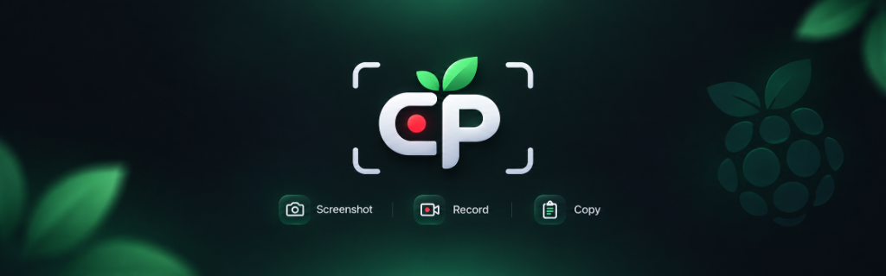

<div align="center">



# CapturePi

**The ultimate lightweight, hardware-accelerated screen capture and recording suite for Raspberry Pi and Wayland Linux.**

[](https://github.com/shrawankhambekar/ScreenshotTool)
[](https://github.com/shrawankhambekar/ScreenshotTool)
[](https://github.com/shrawankhambekar/ScreenshotTool)
[](https://github.com/shrawankhambekar/ScreenshotTool)
[](https://github.com/shrawankhambekar/ScreenshotTool)
[](LICENSE)

*A fast, modern alternative to bulky screenshot tools. Built with native GTK4 Layer Shell and Cairo for zero-lag screen cropping, 1-click full screen snapping, fluid dragging, and high-framerate MP4 video recording with dual audio (Mic + System Sound).*

---

</div>

## 🌟 Why CapturePi?

Most screenshot and screen recording tools for Linux are either built for legacy X11, heavy Electron wrappers that strain Raspberry Pi CPU/RAM, or lack proper Wayland desktop integration.

**CapturePi** is engineered specifically for Wayland environments (standard on Raspberry Pi OS Bookworm & Labwc):
- **Native Wayland Protocol**: Uses `gtk4-layer-shell` and `grim` for pixel-perfect captures without screen tearing.
- **Micro-Footprint**: Fast launch, silky smooth Cairo rendering, and ultra-low memory consumption.
- **Dual Audio Support**: Simultaneously records your microphone and desktop internal system sound (YouTube, video calls, media players).
- **Windows-Style 1-Click Clipboard**: Everything you snap is instantly copied to the system clipboard—ready to paste (<kbd>Ctrl</kbd>+<kbd>V</kbd>) into Discord, Chromium, LibreOffice, or Telegram immediately.

---

## ✨ Key Features

- 📸 **Selective & Fullscreen Snapshots**:
  - **Rectangle**: Select mode, then click and drag across any region with real-time dimensions and translucent guidelines.
  - **1-Click Full Screen**: Select mode, then click anywhere on screen to snap the entire display instantly.
  - **Window Snapping**: Intelligently identifies and snaps to active window boundaries.
- 🎙️ **Dual Audio Recording**:
  - **`🎙 Mic`**: Record external USB / 3.5mm microphone audio input.
  - **`🔊 Audio`**: Record internal system sound playback via PipeWire monitor loopback.
  - **Live Mute Buttons**: Click the Mic or Audio buttons right in the floating bar to mute/unmute streams during recording!
- 🎥 **Smooth Screen Recording (`wf-recorder`)**:
  - Records directly to high-compatibility MP4 (`H.264 / AAC`).
  - **Pause (`❚❚`) & Resume (`▶`)**: Pause recordings on the fly without splitting into multiple video files.
  - **Cursor Capture**: Mouse movements rendered smoothly across all footage.
- 🎛️ **Jitter-Free Draggable HUD**:
  - Floating recording toolbar can be dragged anywhere on screen using the `⠿` grip handle.
  - **Auto-Hiding Overlay**: When selecting a recording area, the toolbar automatically hides so it never ruins your selection.
  - **Auto-Shrinking Minimalist Pill**: During full-screen recording, the toolbar shrinks to a compact, non-intrusive transparent pill (< 38% opacity) at the top of your screen.
- ⚡ **Instant Hardware Keybinding**: Automatically configures the <kbd>Print Screen</kbd> key on Raspberry Pi OS (Labwc), Sway, and Hyprland.

---

## 🚀 Quick Installation

### Method 1: Single-Command Quick Install (Recommended)

Clone the repository and run the installer:
```bash
git clone https://github.com/shrawankhambekar/ScreenshotTool.git CapturePi
cd CapturePi
./install.sh
```

Or from a downloaded release archive:
```bash
unzip -o CapturePi.zip && cd CapturePi && ./install.sh
```

### Method 2: One-Click GUI Desktop Install
1. Open the **`CapturePi`** folder in the Raspberry Pi File Manager.
2. Double-click **`Install CapturePi`** (`install.desktop`).
3. Press <kbd>Enter</kbd> when finished.

---

## 🎯 How to Use

| Shortcut / Command | Action |
| :--- | :--- |
| <kbd>Print Screen</kbd> | **Interactive Overlay**: Launch CapturePi overlay bar to crop, snap fullscreen, or record. |
| <kbd>Shift</kbd> + <kbd>Print Screen</kbd> | **Quick Toolbar Menu**: Horizontal launcher with Rectangle, Full Screen, and Record options. |
| `capturepi` | Launch the interactive GTK4 overlay bar from terminal or app runner. |
| `capturepi-recorder` | Launch the floating screen recorder controller directly. |
| `capturepi-menu` | Launch the quick Wofi toolbar menu. |

> [!TIP]
> **1-Click Paste**: Screenshots are automatically copied to your clipboard (`wl-copy`) and saved to `~/Pictures/Screenshots/`. Screen recordings are saved to `~/Videos/Recordings/rec_*.mp4`.

---

## 🔊 Audio Recording Guide

CapturePi features intelligent PipeWire/WirePlumber integration for audio capture:

| Toggle Button | What It Records | Backend Source |
| :--- | :--- | :--- |
| **`🎙 Mic: ON`** | External microphone, headset, or USB mic | `@DEFAULT_AUDIO_SOURCE@` |
| **`🔊 Audio: ON`** | System sound, YouTube, browser playback, games | `@DEFAULT_AUDIO_SINK@.monitor` |

- In the overlay toolbar, click **● Record** to reveal the `[🎙 Mic]` and `[🔊 Audio]` toggle pills.
- During active recording, click the green audio buttons on the floating HUD to mute or unmute on the fly!

---

## 📦 Compatibility & Dependencies

CapturePi works out-of-the-box on:
- **Raspberry Pi OS** (Bookworm / Wayland / Labwc) — Pi 3B+, Pi 4, Pi 400, Pi 5, Pi 500
- **Debian / Ubuntu** (Wayland session)
- **Arch Linux / Manjaro**
- **Fedora / openSUSE**

The installer verifies and automatically installs:
- `grim` (Wayland image grabber)
- `slurp` (Wayland region selector)
- `wl-clipboard` (Wayland clipboard manager)
- `wf-recorder` (Wayland screen recorder)
- `wofi` (Application menu / quick launcher)
- `python3-gi`, `gir1.2-gtk-4.0`, `gir1.2-gtk4layershell-1.0`, `python3-cairo`

---

## 🗑️ Uninstallation

To cleanly remove all shortcuts, desktop icons, and keybindings:
```bash
./uninstall.sh
```

---

## 📄 License

This project is licensed under the [MIT License](LICENSE).
